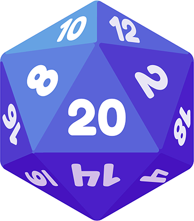

---

  
  
  
  

 
<!-- ABOUT THE PROJECT -->
## About The Project

A Text-Based Adventure Game where the story is carefully crafted around the player's choices. Built using [FastAPI](https://fastapi.tiangolo.com/). 
